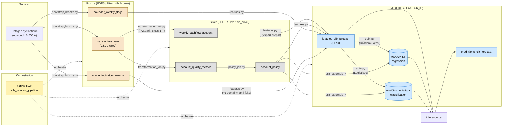
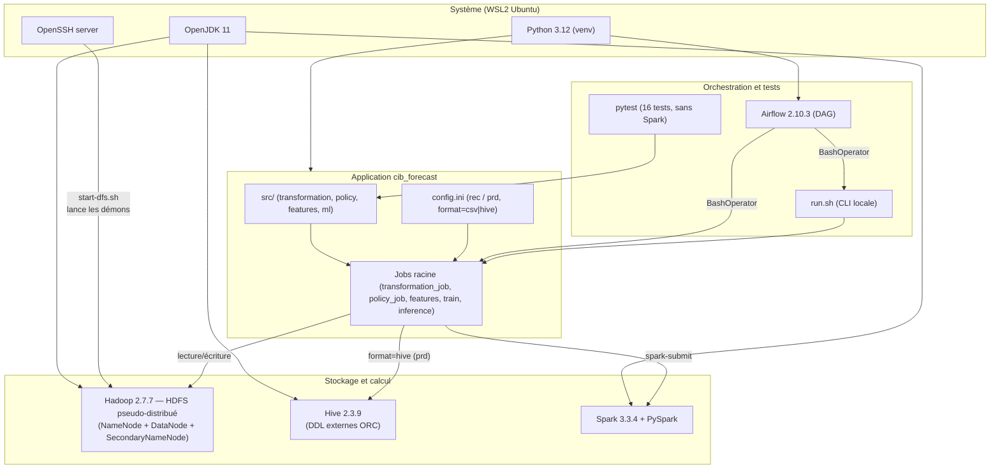
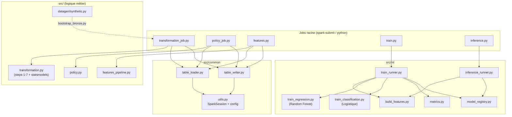
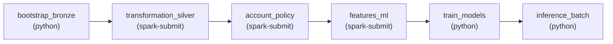
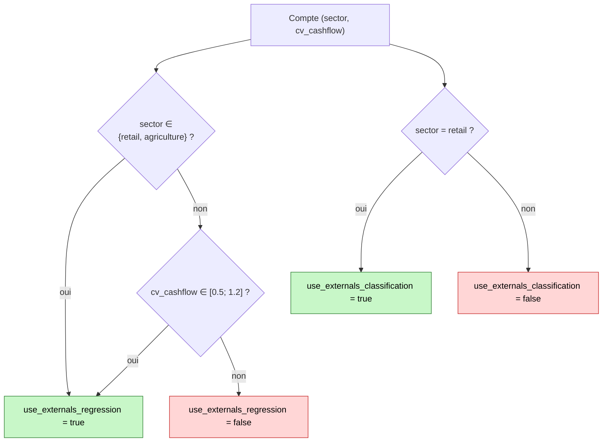

# Architecture du projet CIB Forecast

Ce document regroupe les diagrammes à insérer dans le rapport. Tous les
diagrammes sont en **Mermaid** : ils s'affichent directement dans GitHub,
Notion, VSCode, et la plupart des éditeurs Markdown. Pour les exporter en
PNG, utiliser [Mermaid Live Editor](https://mermaid.live/) ou la CLI
`npx -y @mermaid-js/mermaid-cli -i docs/architecture.md -o out.png`.

---

## 1. Vue d'ensemble — Pipeline de bout en bout

---

## 2. Stack technique — Couches logicielles

---

## 3. Flux de données détaillé — Étapes du notebook → tables

```mermaid
flowchart LR
    A["Transactions brutes\n(numero_compte, date_operation,\nmontant, sector)"] -->|"Step 1\n agg hebdo"| B["weekly_cashflow_account\n(numero_compte, week, sector,\ntotal_amount, transaction_count)"]
    B -->|"Step 2\n stats par compte"| C["stats globales\n(n_obs, cv, mean, std,\ncompleteness_ratio)"]
    C -->|"Step 3\n eligibility"| D["comptes éligibles\n(n_obs ≥ 24)"]
    D -->|"Step 4\n stats TS"| E["ADF, ACF, PACF,\ntrend, saisonnalité"]
    E -->|"Step 5\n filtre validité"| F["comptes valides\n(NaN exclus)"]
    F -->|"Step 6\n scores"| G["composite_score,\npredictability_score"]
    G -->|"Step 7\n filtre qualité"| H["account_quality_metrics\n(comptes haute qualité)"]
    H -->|"policy_job.py"| I["account_policy\n(use_externals_*,\nregression_model,\nclassification_model)"]

    B -->|"Step 8\n lags + rolling +\njoin calendar + macro+1w"| J["features_cib_forecast"]
    I -->|"par compte"| J
    J -->|"train.py par compte"| K["modèles RF + Logistique\nsauvegardés par horodatage UTC"]
    J -->|"inference.py\n(dernière semaine)"| L["predictions_cib_forecast"]
    K --> L

    classDef bronze fill:#f9e4c8,stroke:#8a5a00,color:#000
    classDef silver fill:#e0e0e0,stroke:#444,color:#000
    classDef ml fill:#cfe8ff,stroke:#005ec4,color:#000
    class A bronze
    class B,C,D,E,F,G,H,I silver
    class J,K,L ml
```

---

## 4. Modules du projet (dépendances internes)

---

## 5. DAG Airflow

---

## 6. Politique d'activation des features externes

---

## 7. Validation ML — Walk-forward (3 splits × 4 semaines)

```mermaid
gantt
    title Walk-forward sur 104 semaines (extrait)
    dateFormat  X
    axisFormat  %s
    section Split 1
    Train (88 sem)    :done, 0, 88
    Test (4 sem)      :crit, 88, 92
    section Split 2
    Train (84 sem)    :done, 0, 84
    Test (4 sem)      :crit, 84, 88
    section Split 3
    Train (80 sem)    :done, 0, 80
    Test (4 sem)      :crit, 80, 84
```

